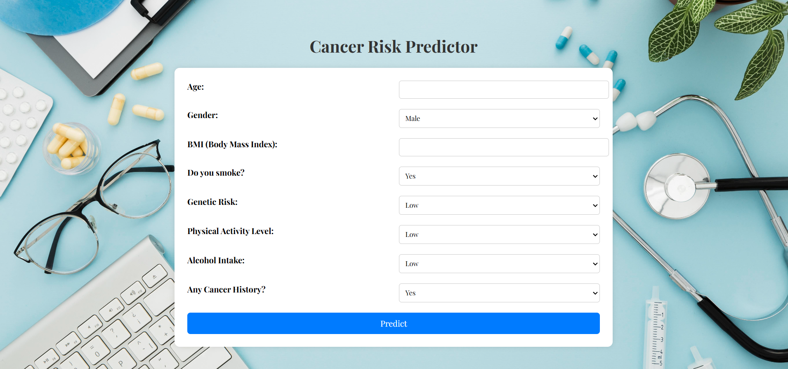

# 🩺 Health Risk Predictor


A machine learning-powered web application built using **Flask** that predicts potential health risks (like cancer) based on user inputs such as lifestyle and genetic factors.

## 📸 Demo



> Enter health-related details and predict the risk instantly.

---

## 🚀 Features

- 🔍 Predicts health risk (e.g. cancer) using an ML model
- 📊 Inputs include Age, BMI, Smoking, Alcohol, Genetics, and more
- ✅ Probability-based results
- 🎨 Responsive UI with modern layout and background image
- 🧠 Trained using `scikit-learn`, and `pandas`

---

## 🛠️ Tech Stack

- **Frontend**: HTML, CSS (vanilla)
- **Backend**: Python Flask
- **ML**: scikit-learn
- **Model Deployment**: joblib

---

## 🏁 How to Run Locally

### 1. Clone the repo

```bash
git clone https://github.com/<your-username>/health-risk-predictor.git
cd health-risk-predictor
```

### 2. Set up virtual environment (optional)

```bash
python -m venv venv
source venv/bin/activate  
```

### 3. Install dependencies

```bash
pip install -r requirements.txt
```

### 4. Add your trained model

Place your trained model file (`model.pkl`) inside the `models/` directory.

### 5. Run the Flask app

```bash
python app.py
```

### 6. Visit in browser

```
http://127.0.0.1:5000/
```

---

## 📁 Folder Structure

```
health-risk-predictor/
├── app.py
├── models/
│   └── model.pkl
├── static/
│   └── bg.jpg
├── templates/
│   └── index.html
├── requirements.txt
└── README.md
```

---

## 📌 Notes

- Make sure your feature names in `app.py` match those used in the training notebook.
- The background image (`bg.jpg`) must be in the `static/` folder.

---

## 📃 License

This project is licensed under the [MIT License](LICENSE).

---

## 🙌 Acknowledgements

- [Flask Documentation](https://flask.palletsprojects.com/)
- [scikit-learn](https://scikit-learn.org/)
- [Pandas](https://pandas.pydata.org/)
```

---

